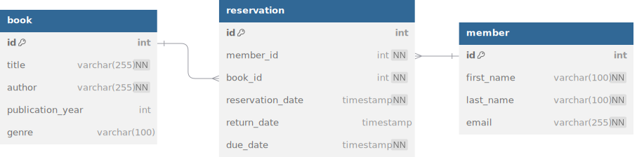

# Query Executor

[**DEMO**](https://vdneste.be/query-executor/)

This project contains a simple GUI to perform queries on a pre-seeded database. It uses the [SQL.js](https://github.com/sql-js/sql.js/) package to spin up an in-memory SQLite database, which means that it will reset to it's default content when u reload the page.

You can use the `manipulate.js` folder to access and manipulate the received data. The JSON checkbox should be checked for this to take effect.

## ERD

